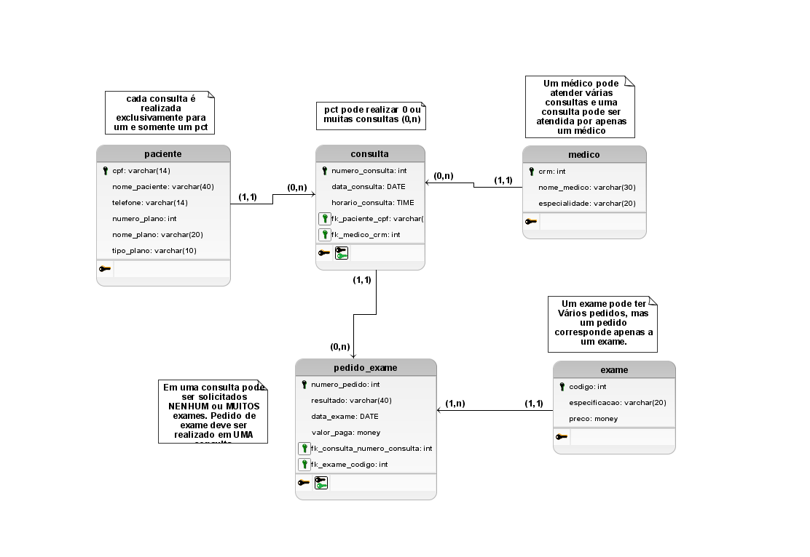

# Banco de Dados clínica médica

## Descrição

<p>
A Dataq é uma empresa focada no desenvolvimento de software, especializada na criação, manutenção, gerenciamento e segurança em banco de dados. Ela foi contratada por uma empresa no ramo da saúde que deseja desenvolver um sistema de controle de Clínica Médica.
</p>

<p>
Assim, a Dataq contratou você para implementar um banco de dados que deverá contemplar as seguintes entidades e respectivos atributos:
</p>


<dl>
    <dt>paciente</dt>
        <dd>• cpf varchar(14) - chave primária</dd>
        <dd>• nome_paciente varchar(40)</dd>
        <dd>• telefone varchar(14)</dd>
        <dd>• numero_plano int</dd>
        <dd>• nome_plano varchar(20)</dd>
        <dd>• tipo_plano varchar(10)</dd>
</dl>

<dl>
    <dt>medico</dt>
        <dd>• crm int chave primária</dd>
        <dd>• nome_medico varchar(30)</dd>
        <dd>• especialidade varchar(20)</dd>
</dl>


<dl>
    <dt>exame</dt>
        <dd>• codigo int chave primária</dd>
        <dd>• especificacao varchar(20)</dd>
        <dd>• preco money</dd>
</dl>

<dl>
    <dt>consulta</dt>
        <dd>• numero_consulta int auto-incremento chave primária</dd>
        <dd>• data_consulta date</dd>
        <dd>• horario_consulta time</dd>
        <dd>• fk_paciente_cpf varchar(14) chave estrangeira</dd>
        <dd>• fk_medico_crm int chave estrangeira</dd>
</dl>


<dl>
    <dt>pedido_exame</dt>
        <dd>• numero_pedido int auto-incremento chave primária</dd>
        <dd>• resultado varchar(40)</dd>
        <dd>• data_exame date</dd>
        <dd>• valor_pagar Money</dd>
        <dd>• fk_consulta_numero_consulta int chave estrangeira</dd>
        <dd>• fk_exame_código int chave estrangeira</dd>
</dl>


### Além disso, para este banco de dados considerar que:

* Cada paciente poderá agendar várias consultas médicas;
* Cada médico poderá atender várias consultas por dia;
* Cada consulta médica poderá ser atendida por um único médico;
* Cada consulta médica poderá ou não ter exames médicos associados;
* Um pedido de exame só poderá conter um tipo de exame médico.
* Cada exame médico pode ser solicitado por vários pedidos de exame.

<p>
A criação das tabelas do banco de dados da clínica médica, deverá seguir o modelo lógico normalizado, definido e validado.
</p>

## Para conseguir implementar o banco de dados como proposto, você deverá superar três desafios:
1. Configurar o gerenciador de banco de dados
2. Modelar o projeto de banco de dados, aplicando procedimentos de modelagem de banco de dados e normalização
3. Construir o banco de dados conforme modelo lógico definido e validado, implementar gatilhos, procedimentos armazenados e controle de acesso.


## Resultados obtidos

### Modelo conceitual



### Modelo físico (populado)

```sql

-- Cria o BD
create database clinica_medica;

-- Seleciona BD para usá-lo
use clinica_medica;

-- Cria tabela paciente
CREATE TABLE paciente (
    cpf varchar(14) PRIMARY KEY,
    nome_paciente varchar(40),
    telefone varchar(14),
    numero_plano int,
    nome_plano varchar(20),
    tipo_plano varchar(10)
);

-- Cria tabela medico
CREATE TABLE medico (
    crm int PRIMARY KEY,
    nome_medico varchar(30),
    especialidade varchar(20)
);


-- Cria tabela pedido_exame
-- auto incremento --
-- identity (valor inicial, incremento) --
CREATE TABLE pedido_exame (
    numero_pedido int identity(2200,1) PRIMARY KEY,
    resultado varchar(40), 
    data_exame date,
    valor_pagar money,
    fk_consulta_numero_consulta int,
    fk_exame_codigo int
);


-- Cria tabela consulta
-- auto incremento --
-- identity (valor inicial, incremento) --
CREATE TABLE consulta (
    numero_consulta int identity(22000,1) PRIMARY KEY,
    data_consulta date,
    horario_consulta time,
    fk_paciente_cpf varchar(14),
    fk_medico_crm int
);

-- Cria tabela exame
CREATE TABLE exame (
    codigo int PRIMARY KEY,
	especificacao varchar(20),
    preco money
);
 
--  Alterações para adição de chaves estrangeiras
ALTER TABLE pedido_exame ADD CONSTRAINT FK_pedido_exame_2
    FOREIGN KEY (fk_consulta_numero_consulta)
    REFERENCES consulta (numero_consulta)
    ON DELETE CASCADE;
 
ALTER TABLE pedido_exame ADD CONSTRAINT FK_pedido_exame_3
    FOREIGN KEY (fk_exame_codigo)
    REFERENCES exame (codigo);
  
ALTER TABLE consulta ADD CONSTRAINT FK_consulta_2
    FOREIGN KEY (fk_paciente_cpf)
    REFERENCES paciente (cpf)
    ON DELETE CASCADE;
 
ALTER TABLE consulta ADD CONSTRAINT FK_consulta_3
    FOREIGN KEY (fk_medico_crm)
    REFERENCES medico (crm)
    ON DELETE CASCADE;


-- Inclusão e seleção de dados

-- tabela paciente
insert into paciente values('012.345.678-90','Leonardo Ribeiro','(11)91234-5678',123456,'Inovamed','Padrão');
insert into paciente values('123.456.789-12','Bruna Alvez','(15)92345-6789',234567,'Ultramed','Básico');
insert into paciente values('234.567.890-23','Gilberto Barros','(11)94567-8901',345678,'Inovamed','Especial');
insert into paciente values('345.678.901-45','Maria Pereira','(12)95678-9012',456789,'Ultramed','Padrão');
insert into paciente values('456.789.012-34','Arnaldo Coelho','(19)96789-0123',567890,'Inovamed','Especial');

select * from paciente;

-- tabela medico
insert into medico values(102030,'Agildo Nunes','Cardiologia');
insert into medico values(203040,'Márcia Alvez','Gastrologia');
insert into medico values(304050,'Roberto Gusmão','Neurologia');
insert into medico values(405060,'Edna Cardoso','Ortopedia');
insert into medico values(506070,'Ricardo Souza','Otorrinolaringologia');
insert into medico values(607080,'Lúcia Marques','Pediatria');
insert into medico values(708090,'Beatriz Lucena','Oncologia');

select * from medico;

-- tabela exame
insert into exame values(10020,'Hemograma',100.00);
insert into exame values(10030,'Tomografia',250.00);
insert into exame values(10040,'Ultrassonografia',550.00);
insert into exame values(10050,'Ressonância',800.00);
insert into exame values(10060,'Radiografia',70.00);
insert into exame values(10070,'Mamografia',150.00);
insert into exame values(10080,'Endoscopia',300.00);
insert into exame values(10090,'Colonoscopia',300.00);
insert into exame values(10100,'Eletrocardiograma',50.00);
insert into exame values(10110,'Ecocardiograma',120.00);
insert into exame values(10120,'Audiometria',65.00);

select * from exame;

-- campos 'auto incremento' não devem aparecer no insert
-- tabela consulta
insert into consulta values('2022/12/12','14:30','012.345.678-90',102030);
insert into consulta values('2022/12/13','08:30','123.456.789-12',203040);
insert into consulta values('2022/12/13','11:00','123.456.789-12',304050);
insert into consulta values('2022/12/14','10:00','234.567.890-23',203040);
insert into consulta values('2022/12/15','15:00','345.678.901-45',405060);
insert into consulta values('2022/12/16','10:00','123.456.789-12',506070);
insert into consulta values('2022/12/19','16:45','234.567.890-23',102030);
insert into consulta values('2022/12/19','18:00','345.678.901-45',607080);
insert into consulta values('2022/12/20','09:00','012.345.678-90',304050);
insert into consulta values('2022/12/20','14:20','123.456.789-12',102030);

select * from consulta;

-- campo 'auto incremento' não deve aparecer no insert
-- resultados possíveis: (normal, inconsistente, indeterminado, negativo, positivo)
insert into pedido_exame values('Normal','2022/12/15',0.00,22000,10040);
insert into pedido_exame values('','2022/12/19',0.00,22000,10100);
insert into pedido_exame values('','2022/12/16',0.00,22001,10080);
insert into pedido_exame values('Normal','2022/12/15',0.00,22002,10050);
insert into pedido_exame values('Inconsistente','2022/12/16',0.00,22003,10080);
insert into pedido_exame values('','2022/12/17',0.00,22004,10060);
insert into pedido_exame values('Normal','2022/12/21',0.00,22007,10020);
insert into pedido_exame values('','2022/12/22',0.00,22008,10030);
insert into pedido_exame values('','2022/12/22',0.00,22008,10050);

select * from pedido_exame;


```